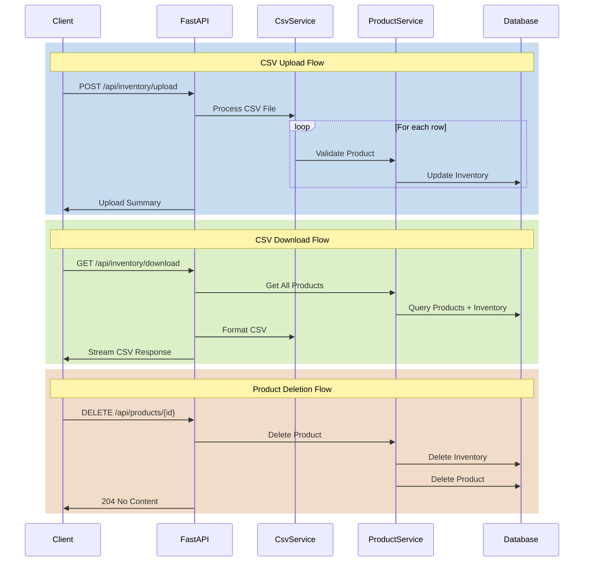

# CSV Inventory Management and Product Deletion Implementation Plan

## Overview

This document outlines the implementation plan for adding CSV-based inventory management capabilities and product deletion functionality to the inventory system.

## Architecture Diagram



## Implementation Steps

### 1. Create CSV Service Module

Create a new service module to handle CSV processing:

```python
# src/inventory_prototype/services/csv_service.py
- Define CSVUploadResponse model (processed_rows, errors)
- Implement parse_inventory_csv(file: UploadFile) -> List[Dict]
- Implement generate_inventory_csv(products: List[Product]) -> StringIO
```

### 2. Update Routes

#### Inventory Routes

```python
# src/inventory_prototype/routes/inventory.py
- Add POST /api/inventory/upload endpoint
  - Accept CSV file
  - Return upload summary
- Add GET /api/inventory/download endpoint
  - Stream CSV response
  - Include headers for file download
```

#### Product Routes

```python
# src/inventory_prototype/routes/products.py
- Add DELETE /api/products/{product_id} endpoint
  - Check product exists
  - Handle cascade deletion
  - Return appropriate status
```

### 3. Update CRUD Operations

```python
# src/inventory_prototype/crud.py
- Add bulk_update_inventory(db: Session, updates: List[Dict])
- Add get_all_products_with_inventory(db: Session)
- Update delete_product to handle inventory cleanup
```

### 4. Test Coverage

```python
# tests/test_inventory/test_integration/test_inventory_scenarios.py
- Test CSV upload with valid data
- Test CSV upload with invalid data
- Test CSV download format
- Test product deletion with/without inventory
```

### 5. Dependencies

Add required dependencies to pyproject.toml:

```toml
# pyproject.toml
- Add python-multipart for file uploads
```

### 6. Documentation Update

Update API documentation:

```markdown
# docs/inventory-api-docs.md

- Document new endpoints
- Include CSV format specifications
- Add example requests/responses
```

## API Specifications

### CSV Upload Endpoint

- **Route**: POST /api/inventory/upload
- **Input**: Multipart form data with CSV file
- **CSV Format**: product_id,quantity
- **Response**: JSON with processed rows count and any errors

### CSV Download Endpoint

- **Route**: GET /api/inventory/download
- **Response**: CSV file stream
- **Headers**: Content-Type: text/csv, Content-Disposition: attachment; filename="inventory.csv"

### Product Deletion Endpoint

- **Route**: DELETE /api/products/{product_id}
- **Response**: 204 No Content on success, 404 if product not found

## Implementation Notes

1. CSV processing should be memory-efficient using streaming
2. Handle potential database transaction rollbacks on partial failures
3. Implement proper error handling and validation
4. Ensure proper HTTP status codes and error responses
5. Add appropriate logging for operations
